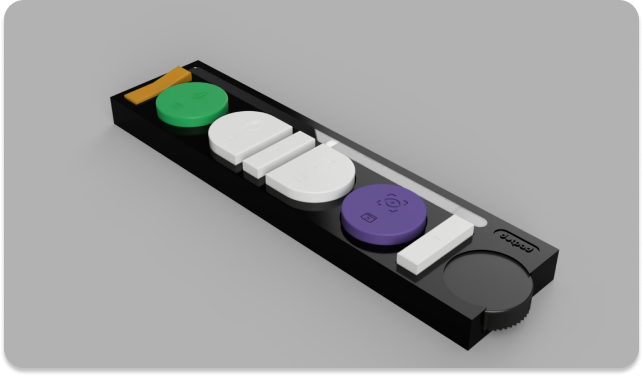

<p align="center">


<h1 align="center">Dotpad</h1>
<p align="center">A controller for browsing the web</p>

<p align="center">


</p>

This is the software repository for the dotpad project. As part of a design research course at the [University of Applied Sciences Lübeck](https://www.th-luebeck.de/), we developed and printed a prototype for a dotpad - a controller that is designed to be used by people with disabilities to control a computer specifically for browsing the web. This repository contains the software that is used to control the computer with the dotpad.



## Development

### Setup

> We assume that you have nodejs and npm installed on your machine.
> If you don't have nodejs and npm installed, you can download it from [here](https://nodejs.org/en/download/).

1. Clone the repository

```bash
git clone 
```

2. Install the dependencies

```bash
npm install
```

3. Start the development server

```bash
npm run dev
```

### Troubleshooting

If you encouter an issue related to serialport, while trying to run the application try the following:

1. Uninstall serialport

```bash
npm uninstall serialport
```

2. Run the following command to rebuild:

```bash
npm rebuild
```

3. Install serialport again

```bash
npm install serialport
```

4. Start the development server without rebuilding

```bash
npm run dev
```

### Debugging

The project contains an .env file with options for debugging. The options are as follows:

- `DEBUG_KEYBOARD_INPUT_MODE`: Set to `true` to enable input via a keyboard for testing.<br>
**Default:** `false`

- `DEBUG_KEYBOARD_INPUT_MODE`: Set to `true` to automatically lock all keys for the application on startup (See Keyboard Input Mode below).<br>
**Default:** `true`

- `DEBUG_OPEN_DEVTOOLS_ON_STARTUP`: Set to `true` open the Chrome DevTools on startup.<br>
**Default:** `false`

#### Keyboard Input Mode
****
***Warning***
Keyboard input mode emulates the use of a dot-pad controller. To allow for inputs while the app is not in focus it will lock all keys listed below on your keyboard. To toggle the lock of the keys press `Numpad *`.

While in keyboard input mode, you can use the following keys to simulate the controller input:

- `Numpad 1`: Press the left side rectangle button. (Orange Tab Toggle)
- `Numpad 2`: Press the left side circle button. (Speech Recognition Toggle)
- `Numpad 4`: Press the left side semi-circle button. (LeftMouse)
- `Numpad 5`: Press the center rectangle button. (Enter)
- `Numpad 6`: Press the right side semi-circle button. (RightMouse)
- `Numpad 7`: Press the right side circle button. (Eye Tracking Toggle)
- `Numpad 8`: Press the right side rectangle button (up). (ElementUp)
- `Numpad 9`: Press the right side rectangle button (down). (ElementDown)

- `Numpad *`: Unlock/Relock the keys.

### Release


When you want to create a new release, follow these steps:

1. Update the version in the project's package.json file (e.g. 1.2.3)
1. Commit that change (`git commit -am v1.2.3`)
1. Tag the commit (`git tag v1.2.3`). Make sure your tag name's format is `v*.*.*` The workflow will use this tag to detect when to create a release
1. Push the changes to GitHub (`git push && git push --tags`)
1. Edit and publish the release draft created by the workflow in GitHub

After building successfully, the action will publish the release artifacts in a new release draft that will be created on GitHub with download links for the app. 